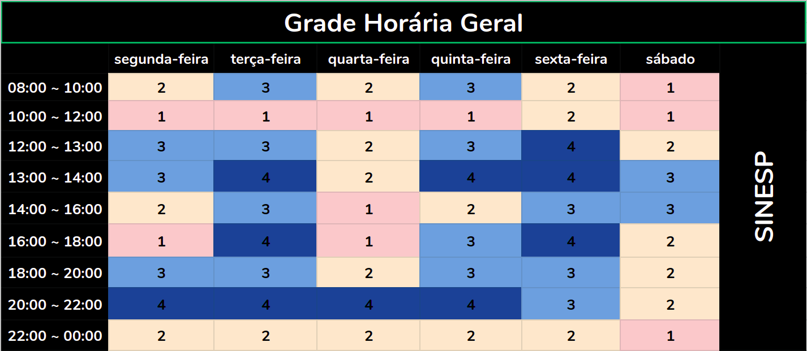

Planejamento
---------------

O planejamento é uma ferramenta administrativa, que possibilita perceber
a realidade, avaliar os caminhos, construir um referencial futuro, o
trâmite adequado e reavaliar todo o processo a que o acoplamento se
destina

Introdução 
---------------

 O Planejamento consiste da preparação, organização e estruturação do projeto. É essencial na tomada de decisões e execução dessas mesmas tarefas. Posteriormente, o planejamento também a confirmação se as decisões tomadas foram acertadas. Portanto, o planejamento serve para auxilar o grupo a se organizar nas tarefas que serão propostas durante o projeto, de acordo com as respectivas datas de entrega. {style="padding: 10px 0 15px 0;"}

Heatmap 
---------------

Cronograma 
---------------

 A seguir, estão descritas todas as datas importantes de entrega da equipe moldado no plano de ensino da matéria. Para cada ponto de controle, estão definidas ao menos duas reuniões presenciais, à priori marcadas para acontecer no sábado, mas que podem ser remarcadas caso seja necessário. Além disso, reuniões à distância ocorrerão sob demanda, conforme for necessário para o desenvolvimento do projeto. É importante salientar também que o cronograma está sujeito a mudanças que, caso ocorram, serão rastreadas no versionamento da página. {style="padding: 10px 0 15px 0;"}

  Pontos  | Data |  Descrição 
  :--------- | :------: | :-------:
  Ponto de Controle 1 | 21/09 | Planejamento do Projeto, equipe, litas de sites avaliados, site selecionado para o projeto da disciplina, Ferramentas do projeto, Processo de Design, cronograma das atividades 
  Ponto de Controle 2 | 05/10 | Perfil do usuário, Personas e Análise de tarefas
  Ponto de Controle 3 | 15/10 |Princípios Gerais de Projeto, Metas de usabilidade, Guia de Estilo. (Fase: análise de requisitos)
  Ponto de Controle 4 | 29/10 | Planejamento da Avaliação e do relato dosresultados da avaliação do Storyboard e Análise de tarefas.
  Ponto de Controle 5 | 05/11 | Planejamento da Avaliação e o relato dos resultados da avaliação do Storyboard e Protótipo de Papel.
  Ponto de Controle 5 | 19/11 | Planejamento da Avaliação e o relato dos resultados da avaliação do protótipo de alta fidelidade.
  **Ponto de Controle 6** | **26/11** | **Entrega da apresentação do projeto final**

Ferramentas Utilizadas 
---------------
  Ferramenta  | Nome |  Descrição 
  :--------- | :------: | :-------:
   | [ZenHub](https://www.zenhub.com) | Subsistema no GitHub que permite gestão ágil do projeto/grupo com interface KanBan
   | [Github](https://github.com/) | Plataforma que será utilizada para gerir e unificar aquilo que o grupo desenvolver
   | [Google Drive](https://www.google.com/intl/pt-BR/drive/) | Plataforma para permitir a edição simultânea de arquivos por todos do grupo
    | [Telegram](https://web.telegram.org/#/login)| Ferramenta de comunicação para avisos gerais, marcar datas de reunião, entre outros

Interação Humano-Computador 2020 SAE
[Github](https://github.com/Interacao-Humano-Computador/2020.1-SAE/).
All rights reserved. 